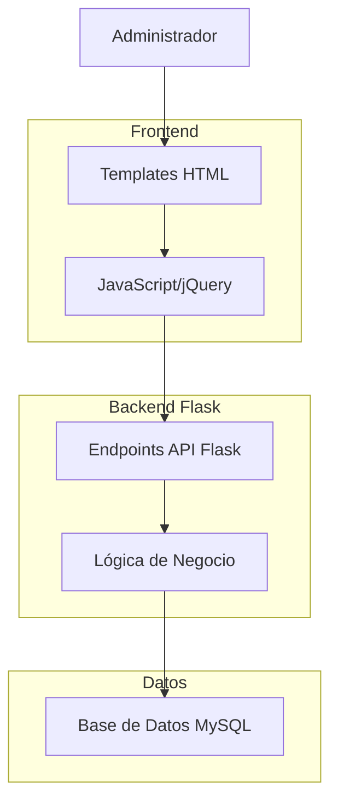

# Arquitectura Técnica - Funcionalidad de Detalles para Administradores

## 1. Diagrama de Arquitectura



## 2. Implementación de Endpoints API

### 2.1 Endpoint - Detalles de Ahorro
```python
@app.route('/api/admin/ahorros/<int:ahorro_id>')
@admin_required
def api_admin_ahorro_detalle(ahorro_id):
    """
    Obtiene los detalles completos de un ahorro específico
    """
    try:
        conn = get_db_connection()
        if not conn:
            return jsonify({'error': 'Error de conexión a base de datos'}), 500
            
        cursor = conn.cursor(dictionary=True)
        
        query = """
        SELECT 
            a.id,
            a.monto,
            a.fecha,
            a.validado,
            u.nombre as usuario_nombre,
            u.apellido as usuario_apellido,
            u.email as usuario_email,
            u.fecha_registro as usuario_fecha_registro
        FROM ahorros a
        JOIN usuarios u ON a.usuario_id = u.id
        WHERE a.id = %s
        """
        
        cursor.execute(query, (ahorro_id,))
        ahorro = cursor.fetchone()
        
        if not ahorro:
            return jsonify({'error': 'Ahorro no encontrado'}), 404
            
        # Formatear la respuesta
        ahorro['fecha'] = ahorro['fecha'].strftime('%Y-%m-%d %H:%M:%S')
        ahorro['usuario_fecha_registro'] = ahorro['usuario_fecha_registro'].strftime('%Y-%m-%d %H:%M:%S')
        ahorro['monto'] = float(ahorro['monto'])
        
        cursor.close()
        conn.close()
        
        return jsonify(ahorro)
        
    except Exception as e:
        return jsonify({'error': str(e)}), 500
```

### 2.2 Endpoint - Pronóstico de Préstamo
```python
@app.route('/api/admin/prestamos/<int:prestamo_id>/pronostico')
@admin_required
def api_admin_prestamo_pronostico(prestamo_id):
    """
    Calcula el pronóstico de pagos para un préstamo
    """
    try:
        conn = get_db_connection()
        if not conn:
            return jsonify({'error': 'Error de conexión a base de datos'}), 500
            
        cursor = conn.cursor(dictionary=True)
        
        # Obtener datos del préstamo
        query = """
        SELECT 
            p.id,
            p.monto,
            p.tasa_interes,
            p.plazo_meses,
            p.fecha_solicitud,
            p.estado,
            u.nombre as usuario_nombre,
            u.apellido as usuario_apellido
        FROM prestamos p
        JOIN usuarios u ON p.usuario_id = u.id
        WHERE p.id = %s
        """
        
        cursor.execute(query, (prestamo_id,))
        prestamo = cursor.fetchone()
        
        if not prestamo:
            return jsonify({'error': 'Préstamo no encontrado'}), 404
            
        # Calcular tabla de amortización
        tabla_amortizacion = calcular_tabla_amortizacion(
            float(prestamo['monto']),
            float(prestamo['tasa_interes']),
            int(prestamo['plazo_meses'])
        )
        
        # Calcular totales
        total_intereses = sum(item['interes'] for item in tabla_amortizacion)
        cuota_mensual = tabla_amortizacion[0]['cuota_total'] if tabla_amortizacion else 0
        
        response = {
            'prestamo_id': prestamo['id'],
            'usuario_nombre': f"{prestamo['usuario_nombre']} {prestamo['usuario_apellido']}",
            'monto_total': float(prestamo['monto']),
            'tasa_interes': float(prestamo['tasa_interes']),
            'plazo_meses': int(prestamo['plazo_meses']),
            'cuota_mensual': cuota_mensual,
            'total_intereses': round(total_intereses, 2),
            'total_a_pagar': float(prestamo['monto']) + total_intereses,
            'tabla_amortizacion': tabla_amortizacion
        }
        
        cursor.close()
        conn.close()
        
        return jsonify(response)
        
    except Exception as e:
        return jsonify({'error': str(e)}), 500
```

### 2.3 Función de Cálculo de Amortización
```python
def calcular_tabla_amortizacion(monto, tasa_interes, plazo_meses):
    """
    Calcula la tabla de amortización mensual para un préstamo
    """
    from datetime import datetime, timedelta
    
    # Convertir tasa anual a mensual
    tasa_mensual = tasa_interes / 100 / 12
    
    # Calcular cuota fija mensual
    if tasa_mensual > 0:
        cuota_fija = monto * (tasa_mensual * (1 + tasa_mensual)**plazo_meses) / ((1 + tasa_mensual)**plazo_meses - 1)
    else:
        cuota_fija = monto / plazo_meses
    
    tabla = []
    saldo = monto
    fecha_base = datetime.now().replace(day=1)
    
    for mes in range(1, plazo_meses + 1):
        # Calcular interés del mes
        interes = saldo * tasa_mensual
        
        # Calcular abono a capital
        abono_capital = cuota_fija - interes
        
        # Actualizar saldo
        saldo -= abono_capital
        
        # Calcular fecha de pago (primer día de cada mes)
        fecha_pago = fecha_base + timedelta(days=30 * mes)
        
        tabla.append({
            'mes': mes,
            'fecha': fecha_pago.strftime('%Y-%m-%d'),
            'abono_capital': round(abono_capital, 2),
            'interes': round(interes, 2),
            'cuota_total': round(cuota_fija, 2),
            'saldo_restante': round(max(saldo, 0), 2)
        })
    
    return tabla
```

## 3. Templates HTML

### 3.1 Modal para Detalles de Ahorro
```html
<!-- Agregar al final de admin_ahorros.html -->
<div class="modal fade" id="modalDetalleAhorro" tabindex="-1">
    <div class="modal-dialog modal-lg">
        <div class="modal-content">
            <div class="modal-header">
                <h5 class="modal-title">Detalles del Ahorro</h5>
                <button type="button" class="btn-close" data-bs-dismiss="modal"></button>
            </div>
            <div class="modal-body">
                <div id="loadingDetalle" class="text-center">
                    <div class="spinner-border" role="status">
                        <span class="visually-hidden">Cargando...</span>
                    </div>
                </div>
                <div id="contenidoDetalle" style="display: none;">
                    <!-- Contenido dinámico -->
                </div>
            </div>
            <div class="modal-footer">
                <button type="button" class="btn btn-secondary" data-bs-dismiss="modal">Cerrar</button>
            </div>
        </div>
    </div>
</div>
```

### 3.2 Modal para Pronóstico de Préstamo
```html
<!-- Agregar al final de admin_pagos_prestamos.html -->
<div class="modal fade" id="modalPronostico" tabindex="-1">
    <div class="modal-dialog modal-xl">
        <div class="modal-content">
            <div class="modal-header">
                <h5 class="modal-title">Pronóstico de Pagos</h5>
                <button type="button" class="btn-close" data-bs-dismiss="modal"></button>
            </div>
            <div class="modal-body">
                <div id="loadingPronostico" class="text-center">
                    <div class="spinner-border" role="status">
                        <span class="visually-hidden">Cargando...</span>
                    </div>
                </div>
                
                <div id="contenidoPronostico" style="display: none;">
                    <!-- Resumen del préstamo -->
                    <div class="row mb-4">
                        <div class="col-md-3">
                            <div class="card">
                                <div class="card-body text-center">
                                    <h6 class="text-muted">Monto del Préstamo</h6>
                                    <h4 id="montoPrestamo" class="text-primary">-</h4>
                                </div>
                            </div>
                        </div>
                        <div class="col-md-3">
                            <div class="card">
                                <div class="card-body text-center">
                                    <h6 class="text-muted">Tasa de Interés</h6>
                                    <h4 id="tasaInteres" class="text-info">-</h4>
                                </div>
                            </div>
                        </div>
                        <div class="col-md-3">
                            <div class="card">
                                <div class="card-body text-center">
                                    <h6 class="text-muted">Plazo (meses)</h6>
                                    <h4 id="plazoMeses" class="text-warning">-</h4>
                                </div>
                            </div>
                        </div>
                        <div class="col-md-3">
                            <div class="card">
                                <div class="card-body text-center">
                                    <h6 class="text-muted">Cuota Mensual</h6>
                                    <h4 id="cuotaMensual" class="text-success">-</h4>
                                </div>
                            </div>
                        </div>
                    </div>

                    <!-- Tabla de amortización -->
                    <div class="table-responsive">
                        <table class="table table-striped">
                            <thead class="table-dark">
                                <tr>
                                    <th>Mes</th>
                                    <th>Fecha</th>
                                    <th>Abono Capital</th>
                                    <th>Interés</th>
                                    <th>Cuota Total</th>
                                    <th>Saldo Restante</th>
                                </tr>
                            </thead>
                            <tbody id="tablaAmortizacion">
                                <!-- Contenido dinámico -->
                            </tbody>
                            <tfoot class="table-light">
                                <tr>
                                    <th colspan="2">TOTALES</th>
                                    <th id="totalCapital">-</th>
                                    <th id="totalInteres">-</th>
                                    <th id="totalCuotas">-</th>
                                    <th>-</th>
                                </tr>
                            </tfoot>
                        </table>
                    </div>
                </div>
            </div>
            <div class="modal-footer">
                <button type="button" class="btn btn-secondary" data-bs-dismiss="modal">Cerrar</button>
                <button type="button" class="btn btn-primary" onclick="exportarTabla()">Exportar PDF</button>
            </div>
        </div>
    </div>
</div>
```

## 4. JavaScript para Funcionalidad

### 4.1 Funciones para Detalles de Ahorro
```javascript
// Agregar en admin_ahorros.html
$(document).ready(function() {
    // Hacer filas clickeables
    $('.clickable-row').click(function() {
        const ahorroId = $(this).data('id');
        cargarDetallesAhorro(ahorroId);
    });
});

function cargarDetallesAhorro(ahorroId) {
    $('#loadingDetalle').show();
    $('#contenidoDetalle').hide();
    $('#modalDetalleAhorro').modal('show');
    
    $.get(`/api/admin/ahorros/${ahorroId}`)
        .done(function(data) {
            const html = generarHtmlDetalleAhorro(data);
            $('#contenidoDetalle').html(html);
            $('#loadingDetalle').hide();
            $('#contenidoDetalle').show();
        })
        .fail(function(xhr) {
            const error = xhr.responseJSON ? xhr.responseJSON.error : 'Error al cargar detalles';
            $('#contenidoDetalle').html(`<div class="alert alert-danger">${error}</div>`);
            $('#loadingDetalle').hide();
            $('#contenidoDetalle').show();
        });
}

function generarHtmlDetalleAhorro(data) {
    return `
        <div class="row">
            <div class="col-md-6">
                <h6>Información del Ahorro</h6>
                <table class="table table-sm">
                    <tr><td><strong>ID:</strong></td><td>${data.id}</td></tr>
                    <tr><td><strong>Monto:</strong></td><td>$${data.monto.toLocaleString()}</td></tr>
                    <tr><td><strong>Fecha:</strong></td><td>${data.fecha}</td></tr>
                    <tr><td><strong>Validado:</strong></td><td>${data.validado ? 'Sí' : 'No'}</td></tr>
                </table>
            </div>
            <div class="col-md-6">
                <h6>Información del Usuario</h6>
                <table class="table table-sm">
                    <tr><td><strong>Nombre:</strong></td><td>${data.usuario_nombre} ${data.usuario_apellido}</td></tr>
                    <tr><td><strong>Email:</strong></td><td>${data.usuario_email}</td></tr>
                    <tr><td><strong>Fecha Registro:</strong></td><td>${data.usuario_fecha_registro}</td></tr>
                </table>
            </div>
        </div>
    `;
}
```

### 4.2 Funciones para Pronóstico de Préstamo
```javascript
// Agregar en admin_pagos_prestamos.html
function cargarPronosticoPrestamo(prestamoId) {
    $('#loadingPronostico').show();
    $('#contenidoPronostico').hide();
    $('#modalPronostico').modal('show');
    
    $.get(`/api/admin/prestamos/${prestamoId}/pronostico`)
        .done(function(data) {
            // Actualizar resumen
            $('#montoPrestamo').text(`$${data.monto_total.toLocaleString()}`);
            $('#tasaInteres').text(`${data.tasa_interes}%`);
            $('#plazoMeses').text(data.plazo_meses);
            $('#cuotaMensual').text(`$${data.cuota_mensual.toLocaleString()}`);
            
            // Generar tabla de amortización
            const tablaHtml = generarTablaAmortizacion(data.tabla_amortizacion);
            $('#tablaAmortizacion').html(tablaHtml);
            
            // Actualizar totales
            $('#totalCapital').text(`$${data.monto_total.toLocaleString()}`);
            $('#totalInteres').text(`$${data.total_intereses.toLocaleString()}`);
            $('#totalCuotas').text(`$${data.total_a_pagar.toLocaleString()}`);
            
            $('#loadingPronostico').hide();
            $('#contenidoPronostico').show();
        })
        .fail(function(xhr) {
            const error = xhr.responseJSON ? xhr.responseJSON.error : 'Error al cargar pronóstico';
            $('#contenidoPronostico').html(`<div class="alert alert-danger">${error}</div>`);
            $('#loadingPronostico').hide();
            $('#contenidoPronostico').show();
        });
}

function generarTablaAmortizacion(tabla) {
    return tabla.map(fila => `
        <tr>
            <td>${fila.mes}</td>
            <td>${fila.fecha}</td>
            <td>$${fila.abono_capital.toLocaleString()}</td>
            <td>$${fila.interes.toLocaleString()}</td>
            <td>$${fila.cuota_total.toLocaleString()}</td>
            <td>$${fila.saldo_restante.toLocaleString()}</td>
        </tr>
    `).join('');
}
```

## 5. Modificaciones en Templates Existentes

### 5.1 Agregar en admin_ahorros.html
```html
<!-- Agregar clase clickable-row a las filas de la tabla -->

<tr class="clickable-row" data-id="{{ ahorro.id }}">
    <td>{{ ahorro.id }}</td>
    <td>{{ ahorro.usuario_nombre }} {{ ahorro.usuario_apellido }}</td>
    <td>${{ "{:,.2f}".format(ahorro.monto) }}</td>
    <td>{{ ahorro.fecha.strftime('%Y-%m-%d') }}</td>
    <td>
        <span class="badge bg-{{ 'success' if ahorro.validado else 'warning' }}">
            {{ 'Validado' if ahorro.validado else 'Pendiente' }}
        </span>
    </td>
</tr>

```

### 5.2 Agregar en admin_pagos_prestamos.html
```html
<!-- Agregar botón de pronóstico en cada fila -->

<tr>
    <td>{{ prestamo.id }}</td>
    <td>{{ prestamo.usuario_nombre }} {{ prestamo.usuario_apellido }}</td>
    <td>${{ "{:,.2f}".format(prestamo.monto) }}</td>
    <td>{{ prestamo.tasa_interes }}%</td>
    <td>{{ prestamo.plazo_meses }}</td>
    <td>{{ prestamo.fecha_solicitud.strftime('%Y-%m-%d') }}</td>
    <td>
        <span class="badge bg-{{ 'success' if prestamo.estado == 'aprobado' else 'warning' if prestamo.estado == 'pendiente' else 'danger' }}">
            {{ prestamo.estado.title() }}
        </span>
    </td>
    <td>
        <button class="btn btn-sm btn-info" onclick="cargarPronosticoPrestamo({{ prestamo.id }})">
            <i class="fas fa-chart-line"></i> Ver Pronóstico
        </button>
    </td>
</tr>

```

## 6. Dependencias Necesarias

### 6.1 JavaScript Libraries
```html
<!-- Agregar en layout.html -->
<script src="https://code.jquery.com/jquery-3.6.0.min.js"></script>
<script src="https://cdn.jsdelivr.net/npm/bootstrap@5.1.3/dist/js/bootstrap.bundle.min.js"></script>
<link rel="stylesheet" href="https://cdnjs.cloudflare.com/ajax/libs/font-awesome/6.0.0/css/all.min.css">
```

### 6.2 Python Dependencies (requirements.txt)
```
Flask==2.3.3
mysql-connector-python==8.0.33
python-dotenv==1.0.0
```

## 7. Testing y Validación

### 7.1 Casos de Prueba
1. **Detalles de Ahorro:**
   - Verificar carga de datos correctos
   - Validar manejo de ahorro inexistente
   - Verificar permisos de administrador

2. **Pronóstico de Préstamo:**
   - Validar cálculo matemático de amortización
   - Verificar formato de fechas
   - Validar totales

### 7.2 Validación de Seguridad
- Verificar que solo administradores puedan acceder
- Validar manejo de errores
- Verificar protección contra SQL injection

## 8. Optimización de Rendimiento

### 8.1 Índices de Base de Datos
```sql
-- Agregar índices para mejorar rendimiento
CREATE INDEX idx_ahorros_id ON ahorros(id);
CREATE INDEX idx_prestamos_id ON prestamos(id);
CREATE INDEX idx_ahorros_usuario_id ON ahorros(usuario_id);
CREATE INDEX idx_prestamos_usuario_id ON prestamos(usuario_id);
```

### 8.2 Caché de Cálculos
- Considerar almacenar tabla de amortización en caché
- Implementar caché Redis para cálculos frecuentes
- Validar invalidez de caché cuando cambian datos del préstamo